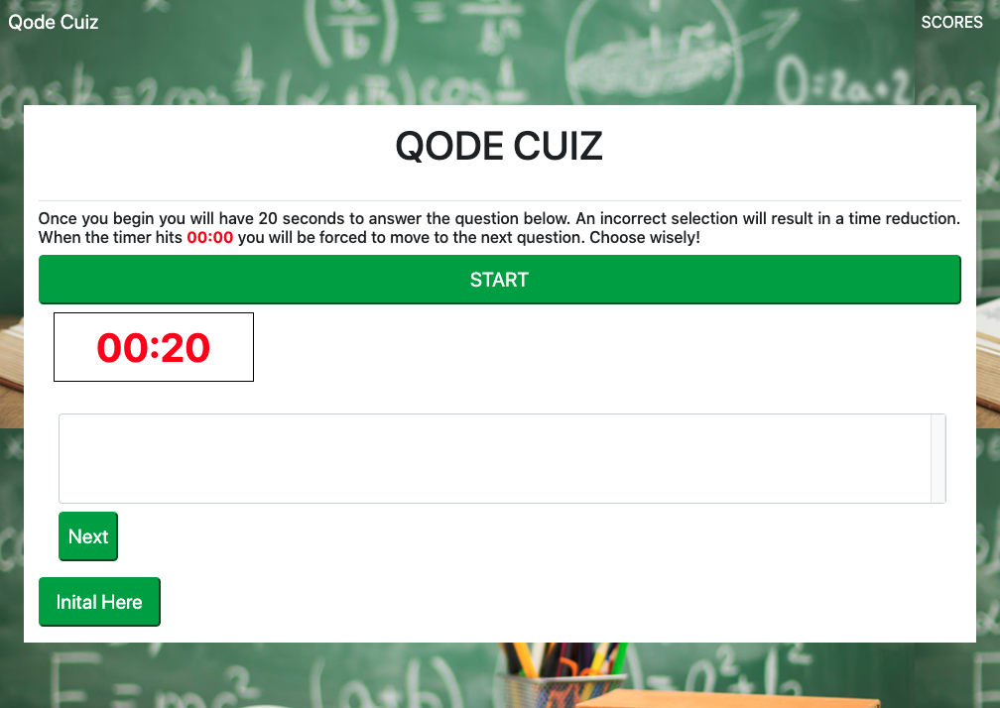
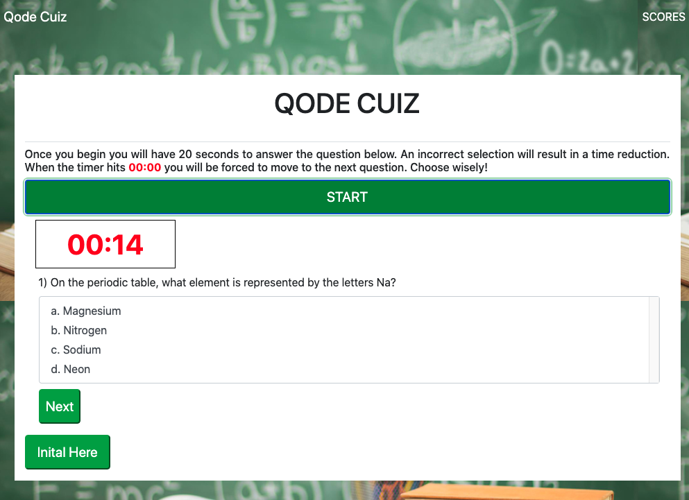
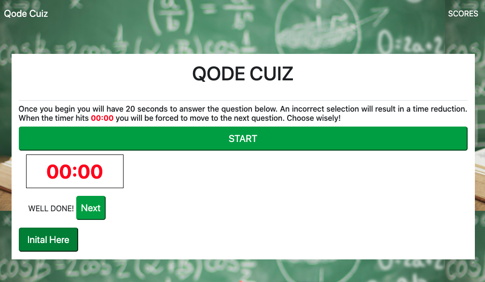
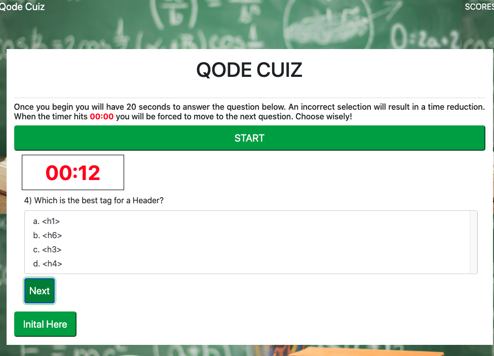
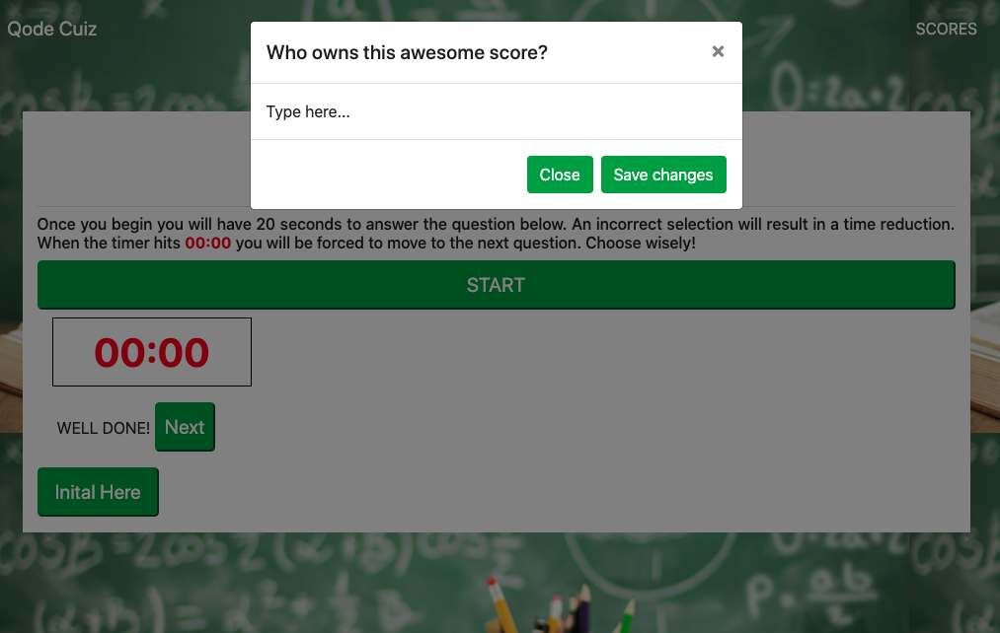
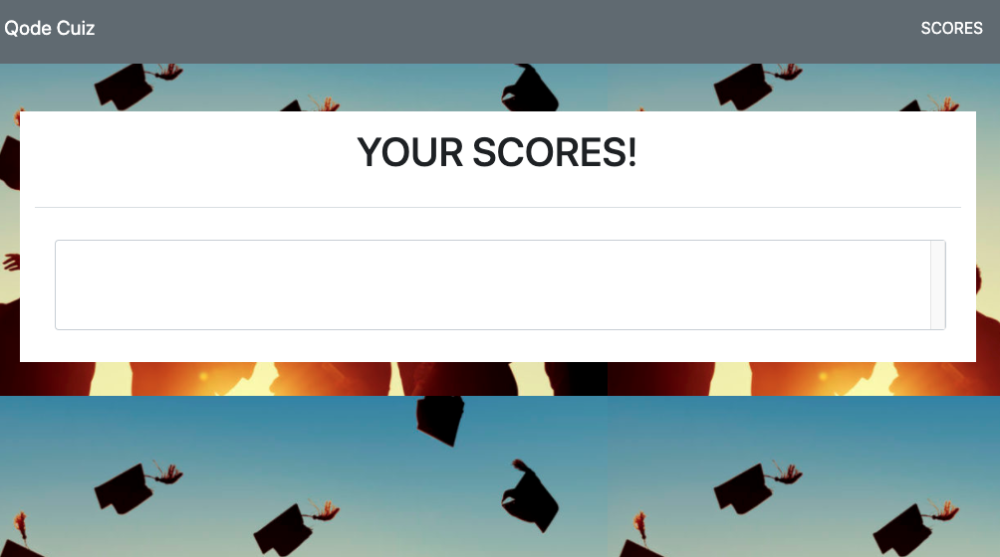

# Code.Quiz
 A timed online Coding Assessment containing multiple choice questions, a time decrement for incorrect responses and score accrual. 

## Description
The purpose of this project was to create an example Coding Assessment that a full-stack web developer might encounter during the interview process and to experience the intricacies involved with designing and coding an online quiz application.  

## Installation

Access the work-in-progress Code Assessment [here.](https://lee-amber-alex.github.io/Code.Quiz/)   
Access Code.Quiz Repository [here.](https://github.com/lee-amber-alex/Code.Quiz)   

## Usage   

### Home Page:

  

### Working Timer:

  

### Correct Answer:

   

### Next Question:

  

### Initials:

   

### Scores Page:

   

## Credits

Freepick imgages used [here.]("http://www.freepik.com")

