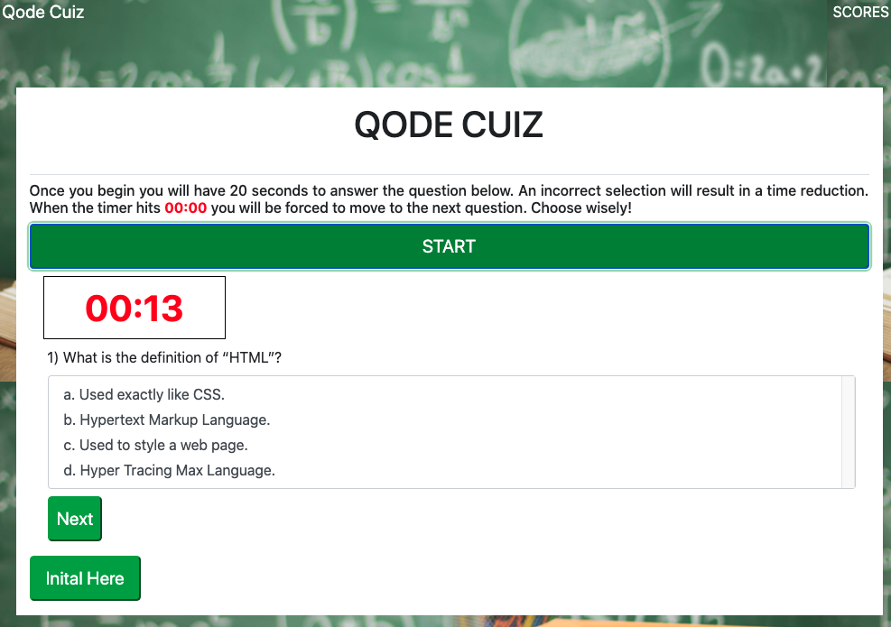

# Code.Quiz

[](https://opensource.org/licenses/MIT)
      
     
## Description

The purpose of this project was to create an example Coding Assessment that a full-stack web developer might encounter during the interview process and to experience the intricacies involved with designing and coding an online quiz application.

## Table of Contents
 
* [Installation](#installation)
* [Usage](#usage)
* [Credits](#credits)
* [License](#license)
 
## Installation
```
npm i
``` 

## Usage
Visit Code.Quiz(work in progress) [here.](https://lee-amber-alex.github.io/Code.Quiz/)  
Access the project repository [here.](https://github.com/lee-amber-alex/Code.Quiz)      

### Home Page:

  

#### Working Timer:

  

#### Correct Answer:

   

#### Next Question:

  

#### Initials:

   

#### Scores Page:

   

## License
This project is covered under the MIT License.
 
## Credits
Freepick imgages used [here.]("http://www.freepik.com")

## Questions
- [Email](lee.amber.alex@gmail.com)
- [Github Page](https://github.com/lee-amber-alex)
 
